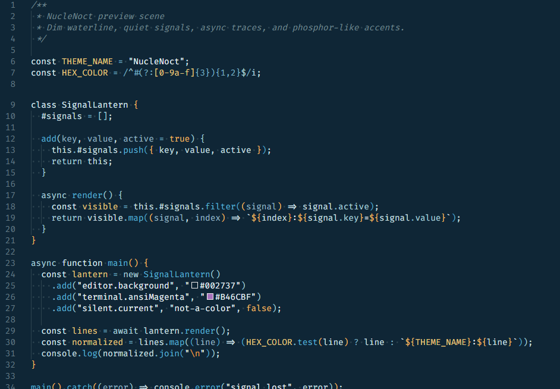
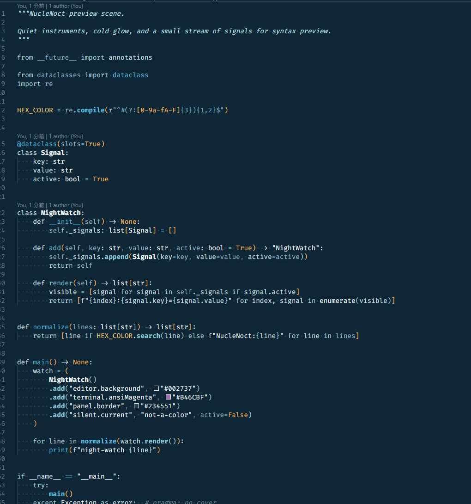
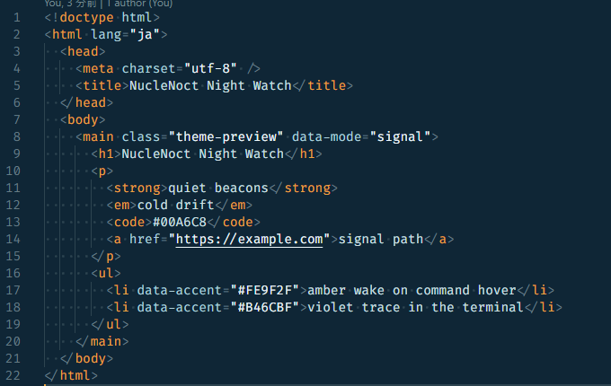
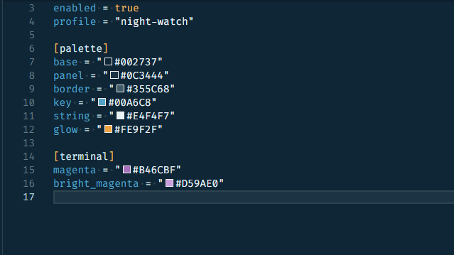

# Nucle Noct

Nucle Noct は、紺をベースにシアンとアンバーで視線誘導を作る VS Code 向けダークテーマです。  
黒に寄りすぎない暗さを保ちながら、UI とコードハイライトの両方を同じ色調で整えています。

## Preview

Concept

JavaScript

Python

HTML

TOML

## 色の方向性

- Base: `#002737`
- Panel: `#0C3444`
- Border: `#234551`
- Accent Cyan: `#00A6C8`
- Accent Soft Cyan: `#66B5C3`
- Accent Amber: `#FE9F2F`
- Text: `#C8E0E4`

コード上では、関数や呼び出し可能シンボルをシアン系、型や構造を明るい寒色、数値や警告をオレンジに寄せています。コメントや補助情報は灰青で抑え、主役の情報だけが前に出るように調整しています。

## Included Coverage

- Workbench UI
- Editor and terminal colors
- Git / SCM decorations
- Problems and diagnostics
- Merge / diff related views
- Semantic highlighting
- Token colors for JavaScript, Go, Python, SQL, HTML, JSON, YAML, TOML, Markdown

## Install

1. VS Code の Extensions を開く
2. `Nucle Noct` を検索する
3. Install を押す
4. `Preferences: Color Theme` から `NucleNoct` を選ぶ
